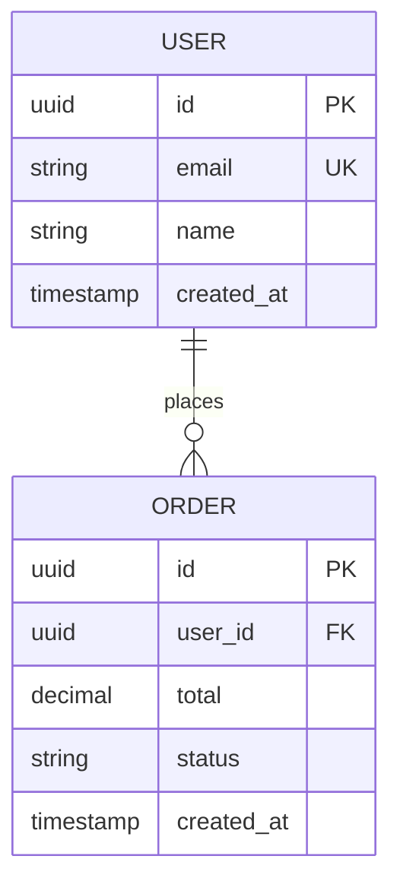

# Doc Generator

Generate living project documents adaptively based on task type, domain, and what the task actually needs.

## Trigger Rules

Reins auto-determines which documents to generate. User can always skip or add.

| Task Type | Documents Generated |
|-----------|-------------------|
| **New feature** | FSD (Functional Spec) + DoD |
| **Architecture change** | SDD (Software Design Doc) + DoD |
| **Product-facing feature** | PRD (Product Requirements) + FSD + DoD |
| **Database changes** | ERD (Entity Relationship Diagram) + SDD + DoD |
| **API endpoint** | FSD + API contract |
| **Bug fix** | Report only (no docs) |
| **Refactor** | SDD (if architectural) or Report only |
| **Migration** | SDD + Migration plan + DoD |
| **New project** | PRD + SDD + ERD (if DB) + FSD |

### Detection Signals

How Reins detects task type:

- **Database changes**: Mentions schema, migration, model, table, column, relation, SQL
- **Product-facing**: Mentions user, customer, UX, UI, flow, experience, page, screen
- **Architecture change**: Mentions pattern, layer, module, service, refactor at system level
- **API endpoint**: Mentions endpoint, route, API, REST, GraphQL, request, response

## Document Formats

All documents are short, focused, and actionable. NOT enterprise bloatware.

### FSD — Functional Specification Document

**Durability rule**: never reference file paths or line numbers in the FSD. Code moves; behavior descriptions don't go stale the same way. Describe interfaces and behavior, not implementation location. The one exception: a short code snippet that precisely encodes a decision (e.g., a type signature) is fine — a `path/to/file.ts:42` pointer is not.

```markdown
# FSD: [Feature Name]

**Date**: [auto]
**Status**: DRAFT | APPROVED | IMPLEMENTED

## Problem Statement
[What problem does this solve, for whom, and why now. 2-3 sentences.]

## Solution
[What we're building, from the user/caller's perspective. 2-3 sentences.]

## User Stories
- As a [role], I want [action], so that [benefit]
- As a [role], I want [action], so that [benefit]

(Exhaustive — cover every user-facing path this feature touches, not just the primary one.)

## Implementation Decisions
[Modules involved, their interfaces, schema shape, API contracts — described behaviorally.
No file paths, no line numbers. If a decision is precisely captured by a type signature or
example payload, include that snippet.]

- [Decision 1]: [what, and the interface/contract it implies]
- [Decision 2]: [what, and the interface/contract it implies]

## Testing Decisions
[What good tests look like for this feature: which modules need interface-level tests,
what prior art in the codebase to follow, what's explicitly NOT going to be tested and why.]

## Out of Scope
- [What this does NOT include]

## Further Notes
[Anything that doesn't fit above but matters — open questions, follow-up work, caveats.]
```

**Max length**: 1 page. If it's longer, it's over-specified. If you're tempted to add file paths for precision, that's a signal you need a code snippet instead, not a location pointer.

### SDD — Software Design Document

```markdown
# SDD: [Component/Change Name]

**Task**: [one-line description]
**Date**: [auto]
**Architecture**: [detected or proposed pattern]

## Overview
[What this changes architecturally. 2-3 sentences.]

## Current State
[How it works now. Brief.]

## Proposed Design
[How it will work. Include structure.]

### Component Diagram
[Simple text diagram or Mermaid]

### Data Flow
[How data moves through the system]

## Key Decisions
| Decision | Choice | Why | Alternative |
|----------|--------|-----|-------------|
| [D1] | [Choice] | [Rationale] | [What we didn't pick] |

## Impact
- **Scope of change**: [which modules/interfaces, described behaviorally — not a file list]
- **Breaking changes**: [yes/no, what]
- **Migration needed**: [yes/no, how]

## Risks
- [Risk 1]: [Mitigation]
```

**Max length**: 1.5 pages. Same durability rule as FSD — describe modules and interfaces, not file paths. Key Decisions that pass the rule-of-three gate (`skills/meta/decision-log/`) should also get their own ADR file, with this SDD referenced from it.

### PRD — Product Requirements Document

```markdown
# PRD: [Product Feature Name]

**Date**: [auto]
**Priority**: HIGH | MEDIUM | LOW

## Problem
[What problem does this solve? Who has this problem? 2-3 sentences.]

## Solution
[What we're building. User perspective. 2-3 sentences.]

## User Stories
- As a [role], I want [action] so that [benefit]
- As a [role], I want [action] so that [benefit]

## Success Metrics
- [How do we know this worked?]

## Requirements
### Must Have
- [Requirement 1]
- [Requirement 2]

### Nice to Have
- [Optional requirement]

### Out of Scope
- [What we're explicitly not doing]
```

**Max length**: 1 page. This is NOT a 20-page enterprise PRD.

### ERD — Entity Relationship Diagram

```markdown
# ERD: [Database Context]

**Date**: [auto]
**Database**: [PostgreSQL/MySQL/MongoDB/etc.]

## Diagram



## Entity Descriptions
| Entity | Purpose | Key Fields |
|--------|---------|------------|
| USER | System user account | email (unique), name |
| ORDER | Purchase order | user_id (FK), total, status |

## Relationships
- USER → ORDER: One-to-many (a user places many orders)

## Indexes
- `users.email` — unique index for login lookup
- `orders.user_id` — foreign key index for user order listing

## Migration Notes
- [Any migration considerations]
```

### DoD — Definition of Done

```markdown
# DoD: [Task Name]

**Date**: [auto]

## Checklist
- [ ] Code implements all acceptance criteria
- [ ] Tests written and passing
- [ ] No new anti-patterns introduced
- [ ] Security checklist completed (if applicable)
- [ ] Performance acceptable (no O(n²), no N+1)
- [ ] Documentation updated (if public API changed)
- [ ] Code reviewed / verification report generated
- [ ] [Task-specific criterion]
- [ ] [Task-specific criterion]

## Verification
- **Type safety**: [pass/fail]
- **Tests**: [X/Y passing]
- **Lint**: [pass/fail]
- **Security**: [pass/fail/N/A]
```

### Test Plan

```markdown
# Test Plan: [Feature Name]

**Date**: [auto]
**Coverage Target**: [realistic percentage]

## Test Categories
### Unit Tests
| Test Case | Input | Expected Output | Priority |
|-----------|-------|-----------------|----------|
| [Case 1] | [Input] | [Expected] | HIGH |

### Integration Tests
| Test Case | Components | Expected | Priority |
|-----------|------------|----------|----------|
| [Case 1] | [A → B] | [Expected] | HIGH |

### Edge Cases
| Scenario | Test | Expected |
|----------|------|----------|
| [Edge 1] | [How to test] | [Expected behavior] |

## Not Tested (Blind Spots)
- [What we can't or won't test, and why]
```

## File Locations

All generated docs go to the structured docs/reins/ directory:

| Doc Type | Location |
|----------|----------|
| FSD | `docs/reins/design/{slug}-fsd.md` |
| SDD | `docs/reins/design/{slug}-sdd.md` |
| PRD | `docs/reins/design/{slug}-prd.md` |
| ERD | `docs/reins/erd/{slug}-erd.md` |
| DoD | `docs/reins/dod/{slug}-dod.md` |
| Test Plan | `docs/reins/test-plans/{slug}-tests.md` |

**slug**: kebab-case of feature name (e.g., `user-auth`, `payment-flow`).

After generating, update `docs/reins/index.md` with links and relationships.

## Mode Behavior

| Mode | Doc Generation |
|------|---------------|
| **prototype** | Skip all docs. Speed first. |
| **vibe** | Generate docs silently. Don't show to user. Available in docs/reins/ for later review. |
| **standard** | Generate relevant docs. Show summary of what was created. |
| **strict** | Generate all applicable docs. Require user review of FSD/SDD before BUILD proceeds. |
| **emergency** | Skip docs. Generate post-fix report only. |

## Rules

1. **Short over complete** — 1-page FSD > 10-page FSD. If it's over 2 pages, you're over-engineering the doc.
2. **Skip irrelevant docs** — Bug fix doesn't need a PRD. Don't generate for the sake of generating.
3. **Update, don't duplicate** — If `user-auth-fsd.md` already exists and you're modifying auth, UPDATE the existing doc rather than creating a new one.
4. **User can always skip** — "skip docs" or "no docs for this" = comply immediately.
5. **Mermaid for diagrams** — Use Mermaid syntax for all diagrams (ERD, sequence, component). Portable and renderable everywhere.
6. **No file paths or line numbers in durable docs** (FSD, SDD, PRD) — they go stale before the doc does. Describe behavior and interfaces instead. Test plans and DoD checklists are exempt since they're inherently tied to the current state of the code.
7. **Use glossary terms** — reference `docs/reins/glossary.md` (see `skills/meta/glossary/`) for canonical terminology. Don't introduce a new synonym for a term that's already defined.
